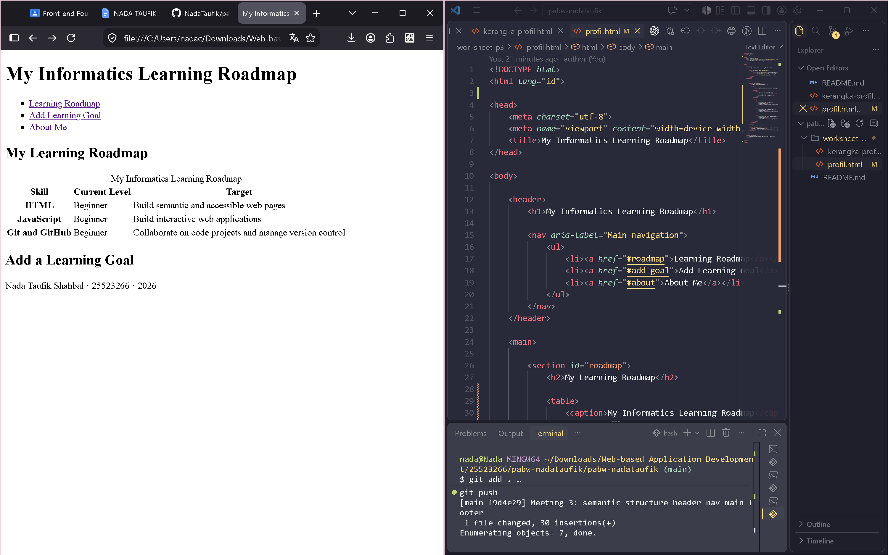

# PABW · Nada Taufik Shahbal · 25523266

This repository contains my coursework for Web-Based Application Development, organized by meeting.

## Meeting 3 · My Informatics Learning Roadmap

### Overview

**My Informatics Learning Roadmap** is a simple semantic HTML5 page that documents the technical skills I am currently learning and the goals I want to achieve as an Informatics student.

The page is designed with clear semantic structure, accessible content, and built-in HTML5 form validation.

### Page Plan

- **Page title:** My Informatics Learning Roadmap
- **Navigation:** Learning Roadmap, Add Learning Goal, About Me
- **Main sections:** My Learning Roadmap and Add a Learning Goal
- **Table columns:** Skill, Current Level, Target
- **Form fields:** Skill Name, Target Level, Target Date
- **Image:** `coding-setup.png`

### Implemented Features

- Semantic HTML5 structure using `header`, `nav`, `main`, `section`, and `footer`
- Clear heading hierarchy with one `h1` and section-level `h2` headings
- Accessible data table using `caption`, `thead`, `tbody`, and `scope`
- Relevant image with descriptive alt text, explicit dimensions, and lazy loading
- Accessible form with linked labels, appropriate input types, and required-field validation
- Internal navigation links connected to their corresponding page sections

### Development Preview

*My web development learning setup.*

### Note on AI Use

AI was used to help organize the page plan, improve wording, explain worksheet requirements, and review parts of the HTML structure. I selected the topic and content, worked through the implementation, tested the page, and managed the Git/GitHub workflow myself.
